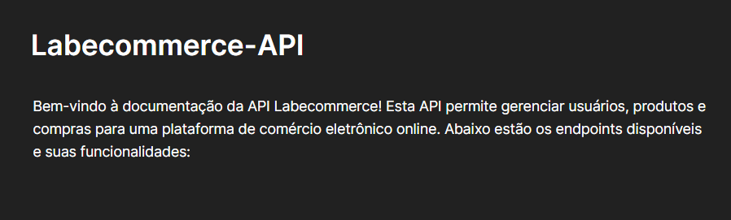

# labecommerce-backend



Este projeto consiste na criação de um banco de dados para gerenciar usuários, produtos e compras. O banco de dados será composto por quatro tabelas principais: users, products, purchases e purchases_products.

## Indice
-  <a href="#funcionalidades">Funcionalidades do projeto<a>
-  <a href="#rodar">Como rodar este projeto?<a> 
-  <a href="#requisições">Requisições<a> 
-  <a href="#exemplos-requisições">Exemplos de requisições<a> 
-  <a href="#tecnologias">Tecnologias utilizadas<a>
-  <a href="#documentação">Documentação<a>
-  <a href="#autoras">Pessoas Autoras<a>

## 📱 Funcionalidades do projeto

- [x] **Obter todos os usuários:** Endpoint para recuperar uma lista de todos os usuários registrados na plataforma.

- [x] **Criar usuário:** Endpoint para criar um novo usuário e adicioná-lo ao banco de dados.

- [x] **Excluir usuário por ID:** Endpoint para remover um usuário do banco de dados usando o seu ID.

- [x] **Criar produto:** Endpoint para adicionar um novo produto ao banco de dados.

- [x] **Obter todos os produtos:** Endpoint para recuperar uma lista de todos os produtos disponíveis na plataforma.

- [x] **Editar produto por ID:** Endpoint para atualizar as informações de um produto específico usando o seu ID.

- [x] **Criar compra:** Endpoint para criar uma nova compra e associar produtos a ela.

- [x] **Excluir compra por ID:** Endpoint para remover uma compra do banco de dados usando o seu ID.

- [x] **Obter compra por ID:** Endpoint para recuperar informações detalhadas sobre uma compra específica usando o seu ID.


## Como rodar este projeto?
```bash
# Clone este repositório
$ git clone repolink

# Acesse o repositório
$ cd projeto-labecommerce

# Instale as dependências
$ npm install

# Rode o servidor
$ npm run dev

```
## 🔧 Tecnologias utilizadas
1. [NodeJS](urlsite)
2. [Typescript]()
3. [Express]()
4. [SQL e SQLite]()
5. [Knex]()
6. [Postman]()

## Requisições(paths)

#### REQUISIÇÔES DE USUARIOS:

- /users

#### REQUISIÇÔES DE PRODUTOS:

- /produtos

#### REQUISIÇÔES DE COMPRAS:

- /purchases

## Exemplos de requisições

#### Get all users


#### Get all products


#### Edit product by id


#### Create purchase


#### Get purchase by id


#### Delete purchase by id


## 👩🏽‍💻 Pessoas Autoras

#### Gleicielen Dourado
